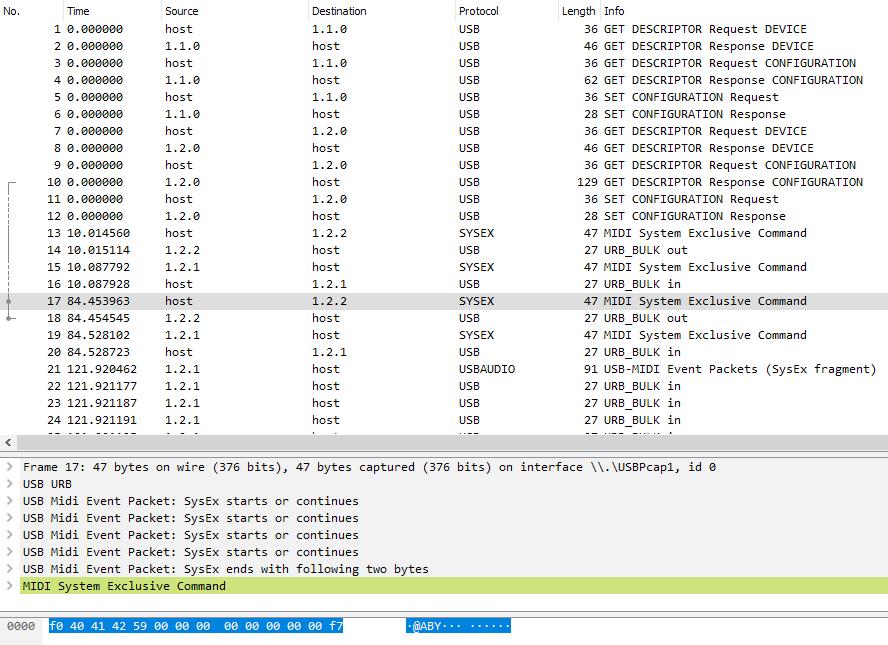

# X-Touch-Mini-HandsOn


I was searching for a control device for an embedded application. The loss of time for developing and building by myself seems to be big. So meeting the Behringer X-Touch Mini seems to be a lucky coincidence. The device is cheap enough and it offers a great functionality for using it at my application (and of course so much other stuff). Please note that I have no music background or studio experience.

If you like to add some information to this repository, please feel free to do that.

## Open points

Actually I tried some stuff with the sniffed SysEx messages. For a complete reconfiguration as it is working with the Windows editor software, I need a checksum and some hints for getting the data to the X-Touch Mini. **So if you are working on the same think and can help me with this matter, please contact me.** I was sniffing the reading and writing process. But no luck if I'm doing this with a script and the same SysEx data, the X-Touch Mini is ignoring my configuration – maybe because of some timing issues? If there is an engineer from Behringer out there with the possibility to provide some information's about this, it would be great!

For now I decided to make this stuff public in hope there is someone who can give me some hints.

## Disadvantages

Yes there are. Even for me.

* Behringer is offering an editor for reconfiguration the device for Windows only. It seems that there is actually no macOS or Linux version in public.
* It seems that Behringer is not interested to give the communication protocol to public. I guess there are some guys out there who can develop an editor for other platforms. There is a documentation for the X-Touch Mini - Ok. So far it does not describe the interesting stuff for that device. In addition to that, there is only a forum. So everything you can read here is the result of doing testings, sniffing and try to reverse engineer.

## What are my use cases?

* I'm a Linux and a macOS user. My first goals are to load / save the settings from the device. In addition to that it would be nice to reconfigure the device without the need of Windows.
* I like to change the device configuration dynamically. Which means I need to load the settings in dependency of my application state. Thinking of using an Raspberry Pi and you like to change the configuration. Actually I have not found a way for doing this.
* You can do much more with it as an add on to a normal keyboard.

## Please note!

All this stuff is not officially by Behringer. I do some testings and tried to reverse engineer. So please be careful and check the [License](LICENSE.md) file. You can use this information's by your own responsibility.

# Documentation

Getting some USB information about the device with an actual Linux installation (5.4 kernel):

```bash
$ lsusb
# ...
Bus 001 Device 007: ID 1397:00b3 BEHRINGER International GmbH X-TOUCH MINI
# ...

$ usb-devices
# ...
T:  Bus=01 Lev=01 Prnt=01 Port=02 Cnt=02 Dev#=  7 Spd=12  MxCh= 0
D:  Ver= 1.10 Cls=00(>ifc ) Sub=00 Prot=00 MxPS=64 #Cfgs=  1
P:  Vendor=1397 ProdID=00b3 Rev=02.00
S:  Manufacturer=Behringer
S:  Product=X-TOUCH MINI
S:  SerialNumber=1.0.1
C:  #Ifs= 2 Cfg#= 1 Atr=80 MxPwr=300mA
I:  If#=0x0 Alt= 0 #EPs= 0 Cls=01(audio) Sub=01 Prot=00 Driver=snd-usb-audio
I:  If#=0x1 Alt= 0 #EPs= 2 Cls=01(audio) Sub=03 Prot=00 Driver=snd-usb-audio
# ...

$ $ amidi --list-devices
Dir Device    Name
IO  hw:1,0,0  X-TOUCH MINI MIDI 1
```

## USB traffic

### Sniffing with Wireshark and USBPcap

For having the X-Touch Editor and Wireshark on one machine, I decided to use a Windows 10 virtual machine. Binding the X-Touch Mini directly to the vitual machine for getting the hardware connection. Actually I thought that Behringer is using a manufacturer specific protocol for the communication with the X-Touch Mini. So I was using Wireshark with the USB Pcap for sniffing the traffic. I opened the X-Touch Editor for the device communication parallel. I was a little bit surprised to see that the communication itself was only some Midi SysEx messages!?



**So it seems that the X-Touch Editor itself is putting the commands for the X-Touch Mini in SysEx messages.**

I created a folder on this repository for storing the captured traffic here `usbtraffic/`.

## So the interesting stuff

* [SysEx Messages](docs/sysex_messages.md)
