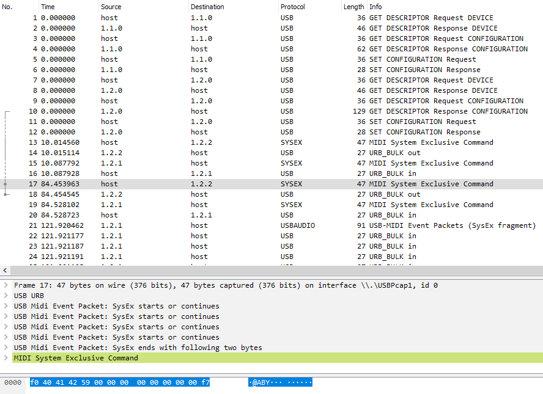

# USB traffic

Actually I thought that Behringer is using a manufacturer specific protocol for the communication with the X-Touch Mini. So I was using Wireshark with the USB Pcap for sniffing the traffic in a virtual machine. I opened the X-Touch Editor for the device communication. I was a little bit surprised to see that the communication itself was only some Midi SysEx messages!?



**So the X-Touch Editor itself is putting the commands for the X-Touch Mini in SysEx messages.**

I tried to switch from "Standard" mode into "MC" mode and back. Getting the data out of Wireshark is not a big deal. Creating a SysEx file with the bash is also easy enough:

```code
$ echo -ne "\xf0\x40\x41\x42\x59\x01\x00\x00\x00\x00\x00\x00\x00\xf7" > switch_to_mc_mode.syx
```

This SysEx file switches the modes.

```code
$ echo -ne "\xf0\x40\x41\x42\x59\x00\x00\x00\x00\x00\x00\x00\x00\xf7" > switch_to_std_mode.syx
```

You can give it a try on a Mac with SysExLibrarian. It put's the SysEx files on the Midi bus.
